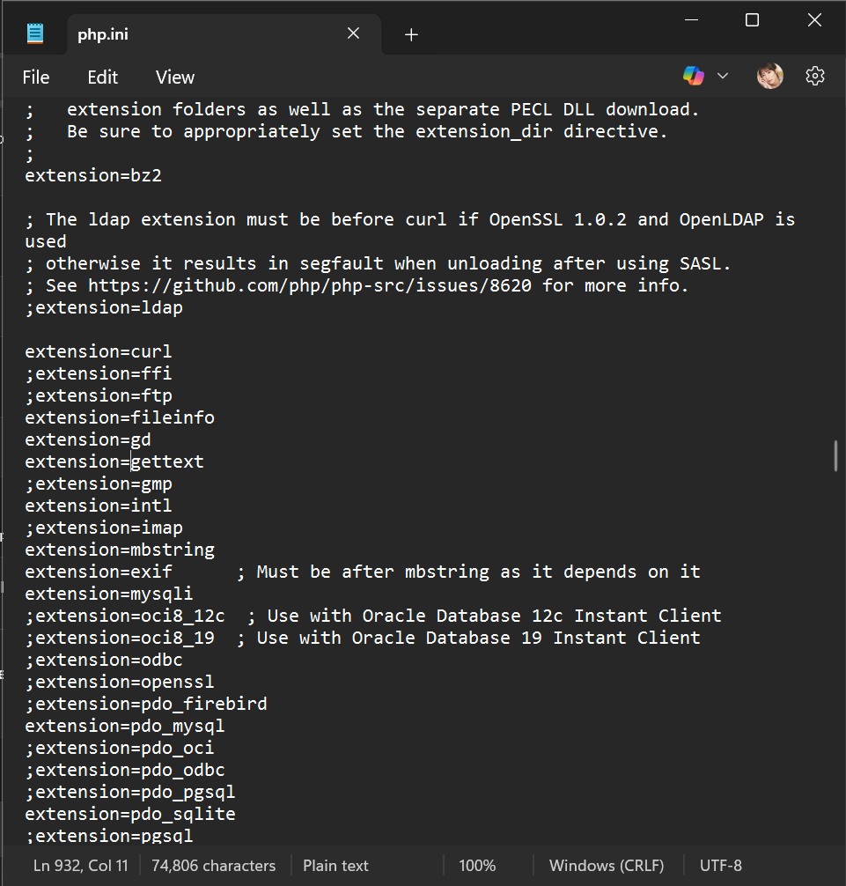
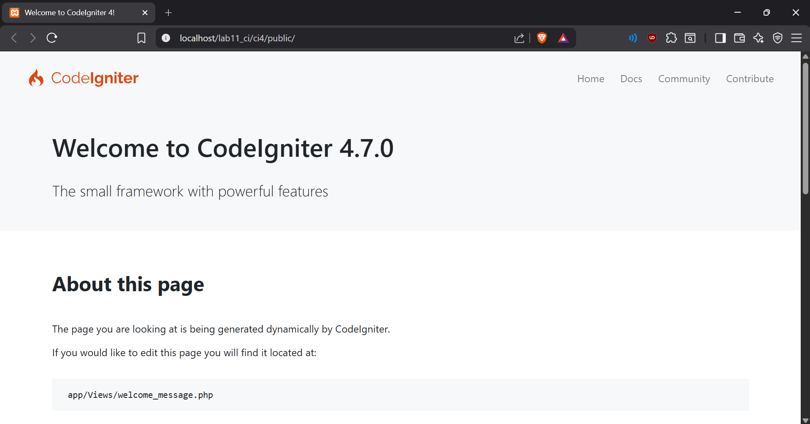
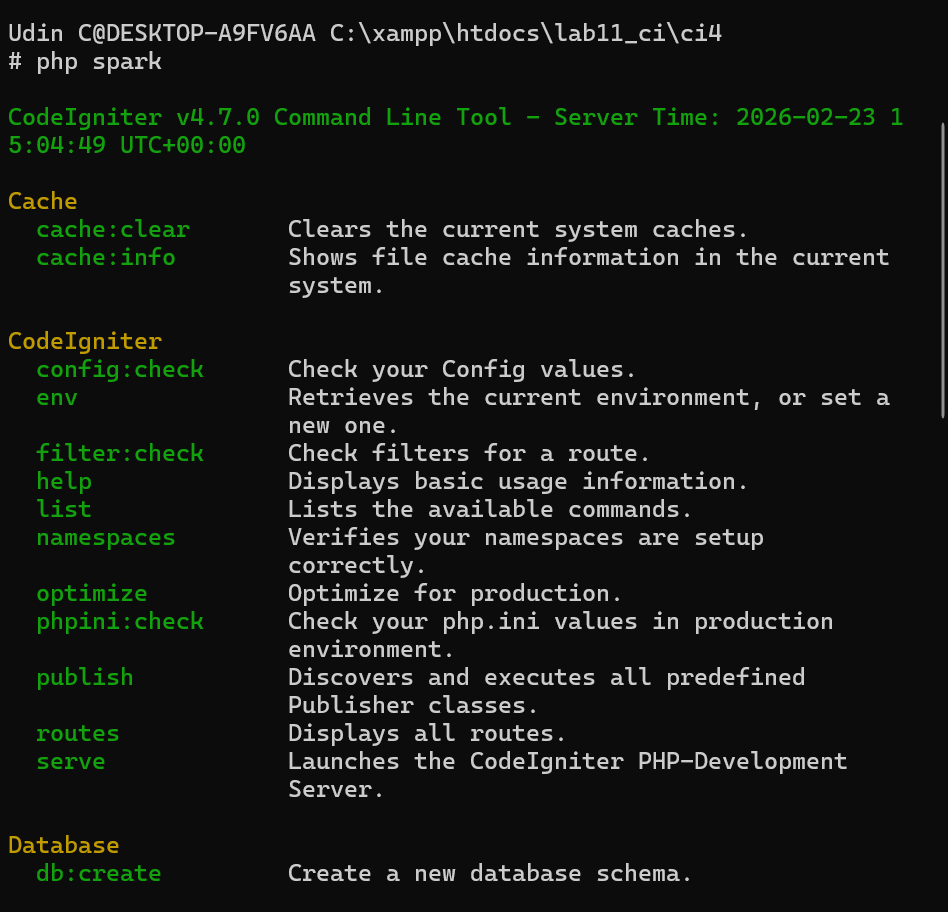
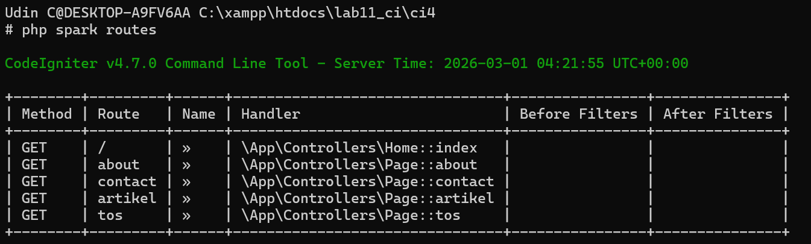
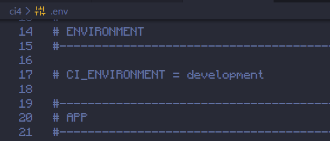
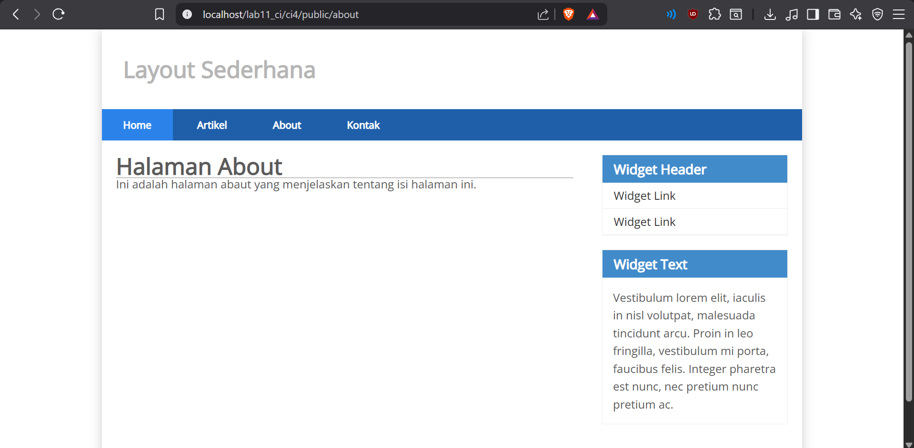
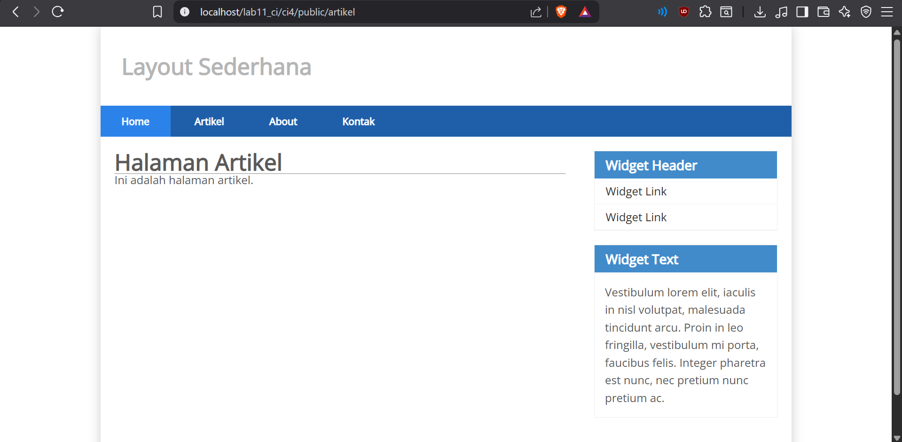
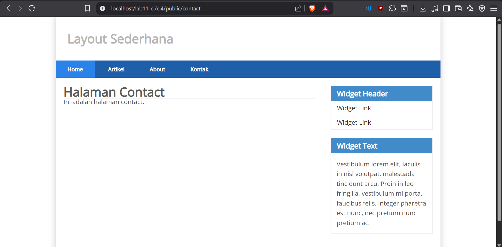

# Praktikum 1: PHP Framework (Codeigniter)

## Nama: Syafarudiansya
## NIM: 312410381
## Kelas: I241A
---

## Langkah-Langkah Praktikum

### Persiapan

- Mengaktifkan ekstensi PHP pada `php.ini`:
  - php-json
  - php-mysqlnd
  - php-xml
  - php-intl
- Restart Apache melalui XAMPP Control Panel.

> 

---

### Instalasi CodeIgniter 4

1. Download CodeIgniter 4 dari website resmi.
2. Ekstrak ke folder:
```
htdocs/lab11_ci
```
3. Ubah nama folder menjadi:
```
ci4
```
4. Jalankan di browser:

http://localhost/lab11_ci/ci4/public/

> 

---

### Menjalankan CLI CodeIgniter

Masuk ke folder project:
```
cd xampp/htdocs/lab11_ci/ci4
php spark
```
Untuk melihat daftar route:
```
php spark routes
```
> 


---

### Mengaktifkan Mode Debugging

- Rename file `env` menjadi `.env`
- Ubah konfigurasi:
```
CI_ENVIRONMENT = development
```
Mode ini digunakan untuk menampilkan detail error saat debugging.

> 

---

## Struktur Direktori CodeIgniter

Folder penting:

- `app/` → Tempat membuat Controller, Model, dan View
- `public/` → File yang bisa diakses publik (index.php, css, js)
- `vendor/` → Library bawaan CodeIgniter
- `writable/` → File log, upload, session

---

## Konsep MVC

### Model
Berfungsi untuk mengelola data (database).

### View
Berfungsi untuk menampilkan tampilan (HTML & CSS).

### Controller
Menghubungkan Model dan View serta memproses request dari user.

---

## Routing

File: `app/Config/Routes.php`

```php
$routes->get('/about', 'Page::about');
$routes->get('/contact', 'Page::contact');
$routes->get('/artikel', 'Page::artikel');
```
---

### Controller

File: `app/Controllers/page.php`

```php
<?php 
namespace App\Controllers;

class Page extends BaseController 
{
    public function about()
    { 
        return view('about', [
            'title' => 'Halaman About',
            'content' => 'Ini adalah halaman abaut yang menjelaskan tentang isi
halaman ini.' 
        ]);
    }
    public function contact() 
    {
        return view('contact', [
            'title' => 'Halaman Contact',
            'content' => 'Ini adalah halaman contact.'
        ]);
    }

    public function artikel() 
    {
        return view('artikel', [
            'title' => 'Halaman Artikel',
            'content' => 'Ini adalah halaman artikel.'
        ]);
    }

    public function tos()
    {
        return view('tos', [
            'title' => 'Term of Services',
            'content' => 'Ini adalah halaman Term of Services.'
        ]);
    }
}
```
### Layout dan CSS

File CSS disimpan di:
```
public/style.css
```
Template layout:

`app/Views/template/header.php`

`app/Views/template/footer.php`

Semua halaman menggunakan layout yang sama dengan:
```php
<?= $this->include('template/header'); ?>
<?= $this->include('template/footer'); ?>
```
> 

### View

Contoh file `about.php`:
```php
<?= $this->include('template/header'); ?>

<h1><?= $title; ?></h1>
<hr>
<p><?= $content; ?></p>

<?= $this->include('template/footer'); ?>
```

File `contact.php` dan `artikel.php` menggunakan struktur yang sama.

> 

